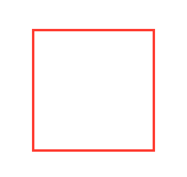
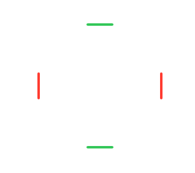

# Chris's SwiftUI Path Elements

A SwiftUI Package to let you process each element in a Shape

## Overview

```
import PathElements

var body: some View {
  Rectangle()
    .elements { index, lastPoint, element in
      ...
    }
}
```

| Before | After |
|--------|-------|
|

